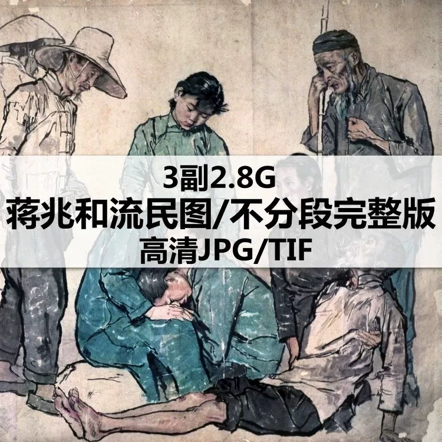
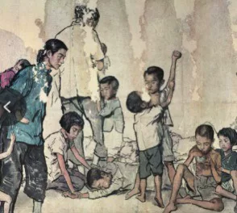
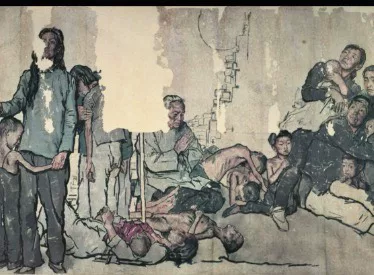
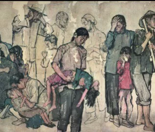

# （Instant download）Jiang Zhaohe's "The Flowing People" High-Definition Digital Map of Three Chinese Paintings for Creative Contemporary Artistry and Tracing

Please note that the specific content of this message may vary depending on the actual product or service you are referring to. If you have any questions about the specific details, it is recommended to consult the official website or contact the relevant company for more information.

## Body

（Instant download）Jiang Zhaohe's "Flowers of the Poor" high-definition electronic map, 3 Chinese painting materials for freehand portrait creation and copying.

(Full product description was not available from the source page.)

## Images

## Payment

Here is a pay link on Stripe ( https://buy.stripe.com/3cs8yP7sY87d0vu9AB ). Please contact me lonlonago@foxmail.com after funding $89, and I will send you a complete data files , thank you!

